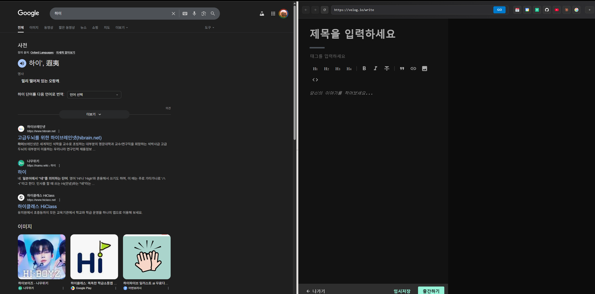

# Split Screen Pro

A Chrome extension that brings Microsoft Edge's split-screen functionality to Chrome browsers.


## 🎯 Motivation

Microsoft Edge has a fantastic built-in split-screen feature that allows users to view two web pages side by side. Unfortunately, Chrome lacks this native functionality. This extension was created to fill that gap and bring the same convenience to Chrome users.

## ✨ Features

- **Vertical Split**: Split the screen vertically to view two pages side by side
- **Horizontal Split**: Split the screen horizontally for top/bottom layout
- **Interactive Resizer**: Drag the divider to adjust panel sizes
- **Session Sync**: Advanced cookie and session synchronization for seamless browsing
- **Tab Integration**: Quick access to currently open tabs
- **Bookmark Integration**: Easy access to Chrome bookmarks
- **History Support**: Quick navigation to recently visited pages
- **Gmail Optimization**: Special handling for Gmail and Google services

## 🚀 Installation

1. Download or clone this repository
2. Open Chrome and navigate to `chrome://extensions/`
3. Enable "Developer mode" in the top right
4. Click "Load unpacked" and select the extension folder
5. The extension icon will appear in your toolbar

## 📖 Usage

1. Click the extension icon in your Chrome toolbar
2. Choose your preferred split mode:
- **Vertical Split**: Creates left and right panels
- **Horizontal Split**: Creates top and bottom panels
3. Use the address bar in the split view to navigate to any website
4. Click on tab icons to quickly switch between open tabs
5. Access bookmarks and history from the initial interface
6. Press `ESC` to exit split view mode

## ⚠️ Known Issues

This extension is currently in development and has several known issues that need addressing:

### 🐛 Critical Bugs

1. **Gmail Cookie Issues**: Gmail experiences cookie synchronization problems, affecting login state
2. **Session Sync Failures**: Some applications (Notion, etc.) don't properly sync login sessions between main window and split view
3. **OAuth Callback Problems**: When logging into services within split view, the callback URLs aren't properly handled, causing login failures
4. **Code Complexity**: The codebase has grown large and needs significant refactoring for maintainability

### 🔧 Help Needed

I'm looking for contributors to help resolve these issues, particularly:
- Cookie and session management experts
- Chrome extension API specialists
- JavaScript developers familiar with iframe security policies
- UI/UX developers for interface improvements

## 📁 Project Structure
```
├── manifest.json          # Extension manifest
├── background.js          # Service worker (missing from current files)
├── content.js             # Main split-screen functionality
├── content.css            # Split-screen styling
├── popup.html             # Extension popup interface
├── popup.js               # Popup functionality
├── rules.json             # Header modification rules
├── favorites.css          # Bookmark styling (unused)
└── icon.png              # Extension icon (missing)
```

## 🛠️ Technical Details

- **Manifest Version**: 3
- **Permissions**: activeTab, storage, scripting, tabs, cookies, bookmarks
- **CSP Bypass**: Uses declarativeNetRequest to modify security headers
- **Session Management**: Advanced cookie synchronization system
- **UI Framework**: Vanilla JavaScript with CSS Grid/Flexbox

## 🤝 Contributing

Contributions are welcome! Please focus on:

1. **Bug Fixes**: Address the known issues listed above
2. **Code Refactoring**: Break down large functions and improve modularity
3. **Security Improvements**: Better handling of cross-origin cookies and sessions
4. **UI/UX Enhancements**: Improve the user interface and experience
5. **Documentation**: Add inline comments and improve code documentation

## 📋 Future Plans

- [ ] Resolve cookie synchronization issues
- [ ] Implement proper OAuth callback handling
- [ ] Refactor codebase into modules
- [ ] Add more customization options
- [ ] Improve error handling and user feedback
- [ ] Prepare for Chrome Web Store distribution
- [ ] Add support for more websites and services

## 📄 License

This project is currently for personal use. Future licensing terms will be determined before public distribution.

---

**Note**: This extension was initially built for personal use but is being prepared for wider distribution. The code needs significant cleanup and bug fixes before it's ready for the Chrome Web Store.

## 🆘 Getting Help

If you encounter issues or want to contribute, please:
1. Check the known issues section first
2. Create detailed bug reports with steps to reproduce
3. Include browser version and website details for session sync issues
4. Consider contributing fixes if you have the expertise

**Current Status**: ⚠️ Development/Beta - Not recommended for production use


